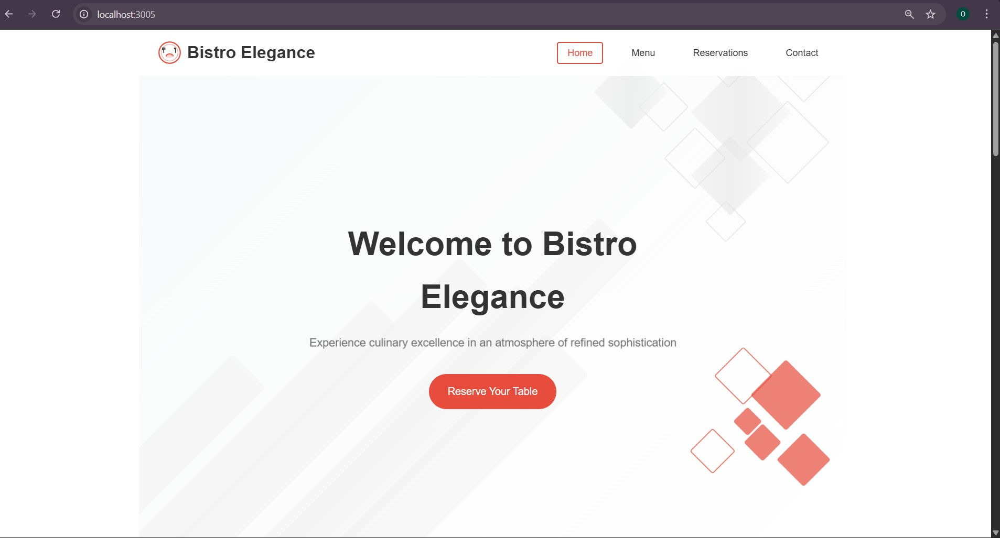
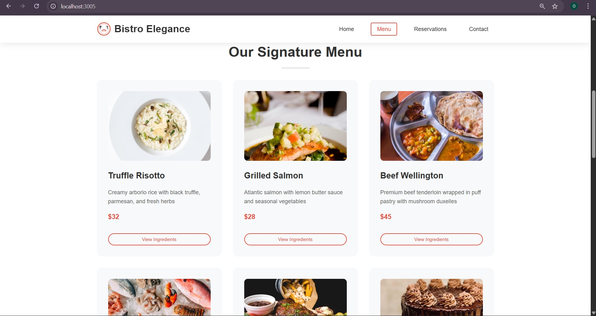
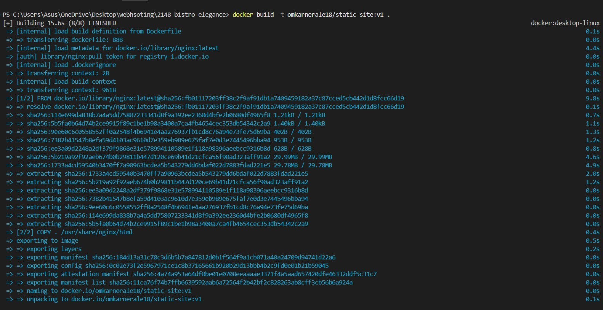
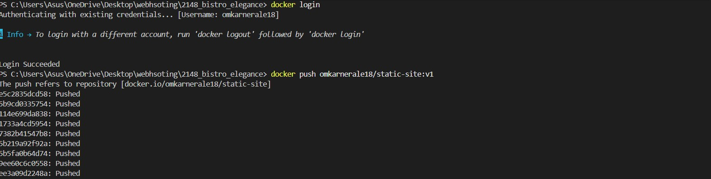

# Kubernetes Static Website using Docker & Port Forwarding

This project demonstrates how to host a **static HTML/CSS/JavaScript website** on **Kubernetes** using **Docker and Deployment**, and access it locally using **kubectl port-forward** without exposing the application via a Service.


The Docker image for this application is **built locally and pushed to Docker Hub**, and then pulled by Kubernetes during deployment.


The website used in this project is a restaurant-themed static site (Bistro Elegance).

---


## 📦 Docker Image (Docker Hub)

The application image is publicly available on Docker Hub:

```text
omkarnerale18/static-site
```
---

## 🚀 Tech Stack

- HTML, CSS, JavaScript (Static Website)
- Docker (NGINX-based image)
- Kubernetes
  - Deployment
  - Port Forwarding
- kubectl

---

## 🐳 Dockerfile Overview
- Uses nginx
- Copies static files to /usr/share/nginx/html
- Exposes port 80

---

## ☸️ Kubernetes Deployment
- Deploys the static website using a Deployment
- Runs multiple replicas for scalability
- Uses the Docker image built for the static site

1. Apply deployment:
   ```powershell
   kubectl apply -f deployment.yaml
   ```
2. Verify:
   ```powershell
   kubectl get pods
   kubectl get deployments
   ```

   ---
   
## 🔌 Accessing the Website (Without Service)
  1. The application is accessed locally using port forwarding:
  ```powershell
  kubectl port-forward deployment/static-site-deployment 3005:80

  ```
2. Open in browser:
  ```powershell
  http://localhost:3005

  ```
---
## 📸 Screenshots
## Website Running on Localhost




## Building Docker Image


## Pushing Docker Image to DockerHub


## Kubernetes resources and Port Forwarding


  
